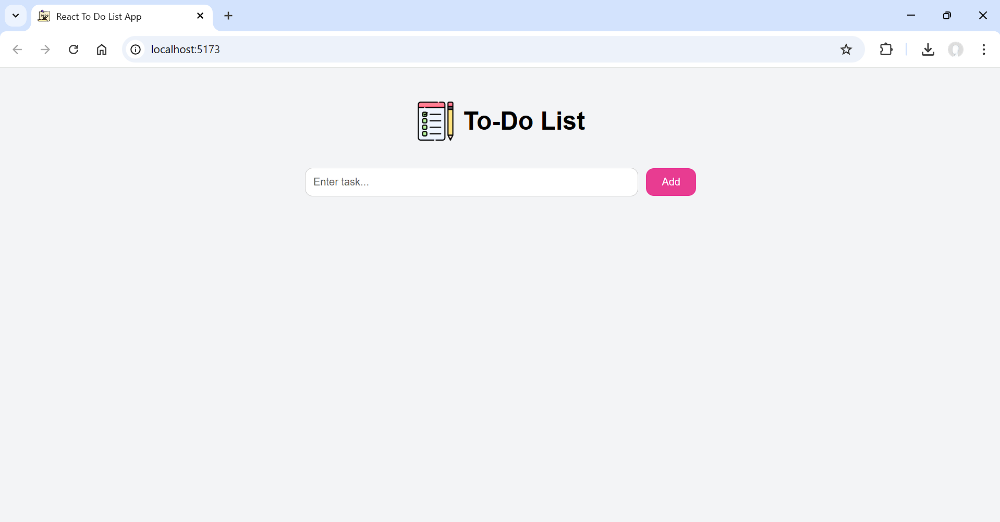
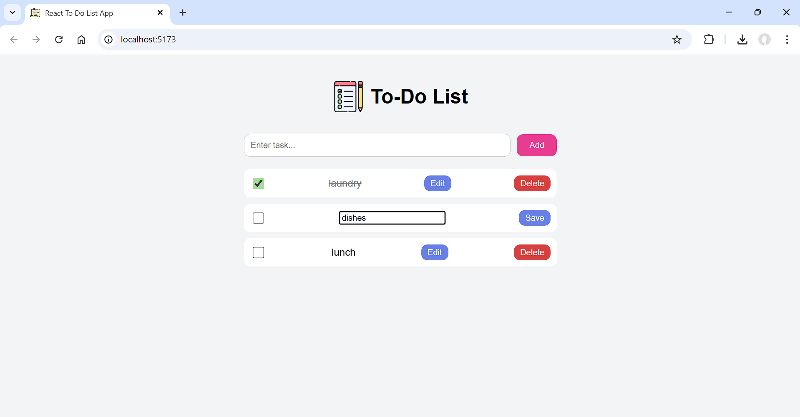
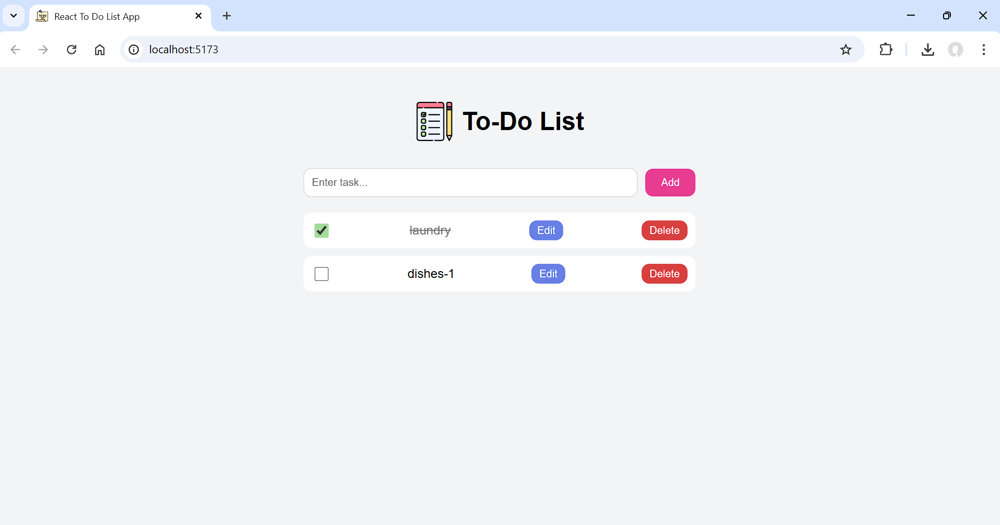

# To-Do List Web Application (React + Vite)

A clean and responsive **To-Do List** application built using **React**,
**Vite**, and modern **CSS**.
This project demonstrates effective use of functional components, hooks,
and component-based UI design.

---

## 🚀 Features

- Add new tasks
- Edit and delete existing tasks
- Mark tasks as completed
- Custom styled checkboxes
- Responsive UI using CSS Flexbox
- Clean component structure

---

## 🛠️ Tech Stack

- **React** (Functional Components + Hooks)
- **Vite** (Fast build tool)
- **CSS** (Custom styling, Flexbox)

---

## 📁 Project Structure

    src/
     ├── components/
     │    ├── TodoInput.jsx
     │    ├── TodoItem.jsx
     │    └── TodoList.jsx
     ├── App.jsx
     ├── main.jsx
     └── index.css

---

## ▶️ Running the Project

### 1. Install dependencies

    npm install

### 2. Start development server

    npm run dev

### 3. Build for production

    npm run build

---

## 📌 How It Works

- React's `useState` manages the task list.
- Tasks are passed as props to child components.
- CSS handles layout, spacing, and checkbox styling.

---

## 📷 Screenshots

---

## 📄 License

This project is open-source and available under the MIT License.
